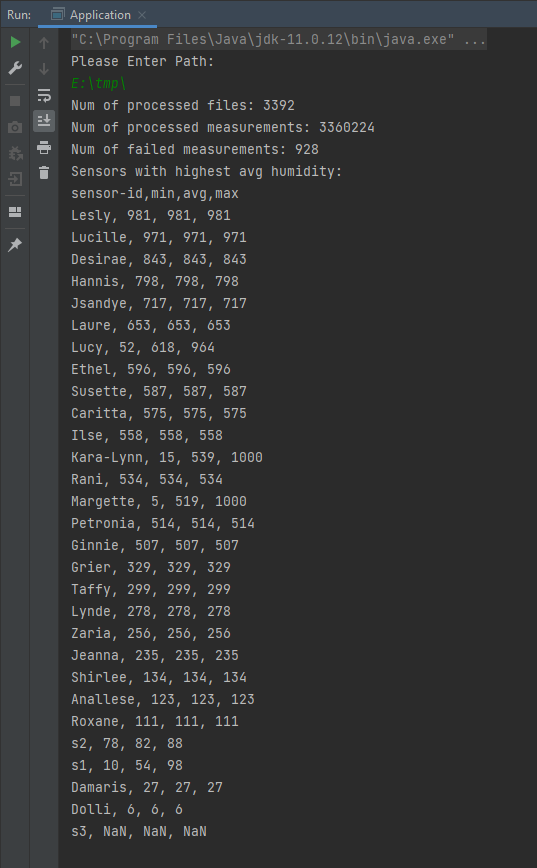
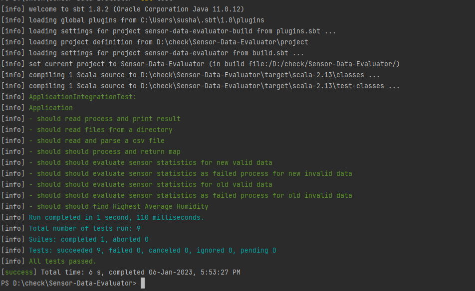

# Sensor Statistics Task

Create a command line program that calculates statistics from humidity sensor data.

### Background story

The sensors are in a network, and they are divided into groups. Each sensor submits its data to its group leader.
Each leader produces a daily report file for a group. The network periodically re-balances itself, so the sensors could
change the group assignment over time, and their measurements can be reported by different leaders. The program should
help spot sensors with highest average humidity.

## Input

- Program takes one argument: a path to directory
- Directory contains many CSV files (*.csv), each with a daily report from one group leader
- Format of the file: 1 header line + many lines with measurements
- Measurement line has sensor id and the humidity value
- Humidity value is integer in range `[0, 100]` or `NaN` (failed measurement)
- The measurements for the same sensor id can be in the different files

### Example

leader-1.csv
```
sensor-id,humidity
s1,10
s2,88
s1,NaN
```

leader-2.csv
```
sensor-id,humidity
s2,80
s3,NaN
s2,78
s1,98
```

## Expected Output

- Program prints statistics to StdOut
- It reports how many files it processed
- It reports how many measurements it processed
- It reports how many measurements failed
- For each sensor it calculates min/avg/max humidity
- `NaN` values are ignored from min/avg/max
- Sensors with only `NaN` measurements have min/avg/max as `NaN/NaN/NaN`
- Program sorts sensors by highest avg humidity (`NaN` values go last)

### Example

```
Num of processed files: 2
Num of processed measurements: 7
Num of failed measurements: 2

Sensors with highest avg humidity:

sensor-id,min,avg,max
s2,78,82,88
s1,10,54,98
s3,NaN,NaN,NaN
```

## Notes

- Single daily report file can be very large, and can exceed program memory
- Program should only use memory for its internal state (no disk, no database)
- Any open source library can be used (besides Spark)
- Please use vanilla scala, akka-stream, monix or similar technology.
- You're more than welcome to implement a purely functional solution using cats-effect, fs2 and/or ZIO to impress,
  but this is not a mandatory requirement.
- Sensible tests are welcome


# Solution:

### Assumption
1. Directory will only have csv files.
2. CSV will always have a header and 2 columns of data in the format ``sensor-id, humidity``

### Suggested Solution
1. Idiomatic approach, using vanilla scala and FS2 [https://fs2.io/#/] (Reasoning: Build in IO operators working with streams)
2. To avoid using mutable variables, I have used hash map which has fairly better access time and plus we have unique keys.
3. Wrap certain heavy operations to Cats effects IO to run them lazily.
4. Load all content at once, though we do read file content in 2 MB chunks.
5. Traverse and process through data with a tail recursive approach.
6. Use map to store sensorId and update values based on traversal.
7. Evaluate statistics and generate responses.

### Working Image:
Data set: 3 million plus records.



### Running

You need to download and install sbt for this application to run.

#### Pre-requisite
Scala 2.13.10  
SBT 1.8.2  
Java 11 (This application works best with Java 11)  


Once you have sbt installed, type/run the following command in the terminal:

```bash
sbt run
or
Run via IDE
```

#### Testing
Please note change dirPath in ```ApplicationIntegrationTest``` based on the operating system being used  

Mine is Windows:
```private val dirPath = "src/test/resources/"```

Similarly for Mac OS
```private val dirPath = "src\test\resources\"```

To run Unit test:
```bash
sbt test
or
Run test via IDE
```


#### Extensions
1. If we will be processing even larger data sets, we could think of using parallel computations, this however would need increase in cpu threads. 


